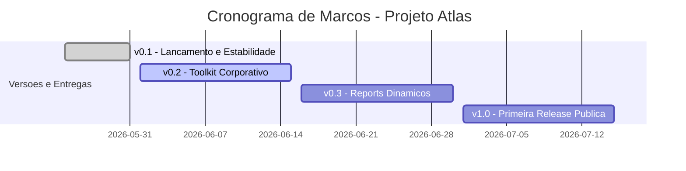

# Atlas - Roadmap do Projeto

Este arquivo define os marcos tecnologicos da evolucao do assistente Atlas e o planejamento das proximas sprints.

## Planejamento de Marcos (Milestones)

---

### v0.1 — Lancamento e Estabilidade (Concluido)
* **Objetivo**: Estabilizar o motor de automacao em Windows e Linux, garantir compatibilidade retroativa com o Windows PowerShell 5.1 e unificar o gerenciamento de logs.
* **Modulos Principais**: Diagnostico rapido, Limpeza segura, Rede e internet, OneDrive, Impressoras, Reparos locais e Coletor de suporte basico.

---

### v0.2.3 — Catalogo e Log de Sessao (Concluido)
* **Objetivo**: Instalacao de programas rapida, organizada e auditavel.
* **Entregas**:
  * Catalogo em `config/software-catalog.json` (Navegadores, PDF, Dev, Infra, DB, Microsoft, Utilitarios)
  * Confirmacao unica por instalacao; winget silent com validacao `winget show`
  * Log persistente por sessao em `logs/sessions/`
  * RSAT e Microsoft 365 como fluxos especiais
  * Atualizar todos (winget upgrade) e inventario (winget list)

---

### v0.2.2 — Suporte Real e Instalacao Basica (Concluido)
* **Objetivo**: Melhorar o Atlas para uso real de suporte tecnico no dia a dia.
* **Entregas**:
  * Relatorio HTML profissional com cards de status, problemas, lentidao, rede, RDP, OneDrive, impressoras e Windows
  * OneDrive: desinstalar, limpar residuos e reinstalar via pagina oficial
  * Outlook: reparo e desinstalacao assistida via telas do Windows
  * Instalacao de programas basicos via winget (menu opcao 10)

---

### v0.2 — Toolkit Corporativo (Concluido)
* **Objetivo**: Desenvolver novos modulos isolados focados em software corporativo, navegadores de mercado, programas instalados no sistema e saude de servicos essenciais do Windows.
* **Novas Modulos (Fase Alfa Isolada)**:
  * **Outlook Toolkit (`outlook.ps1`)**:
    * Diagnostico de status da instalacao do MS Outlook local.
    * Gerenciamento de processos ativos e deteccao de perfis de email.
    * Atalhos rapidos para abertura de logs de sincronizacao e pastas de dados OST/PST.
  * **Teams Toolkit (`teams.ps1`)**:
    * Verificacao de instalacao e processos em execucao.
    * Limpeza automatica e segura do diretorio de cache do MS Teams clássico/moderno.
  * **Browser Toolkit (`browser.ps1`)**:
    * Deteccao de perfis do Google Chrome, Microsoft Edge e Mozilla Firefox.
    * Limpeza automatica de dados temporarios e cache local dos navegadores do usuario.
  * **Programs Toolkit (`programs.ps1`)**:
    * Inventario e extracao de programas instalados no registro do Windows (User e Machine).
    * Exportacao formatada em arquivo CSV unificado em `reports/programs.csv`.
  * **Services Toolkit (`services.ps1`)**:
    * Identificacao do status e tipo de inicializacao de servicos corporativos essenciais.
    * Diagnostico de servicos automáticos que estao indevidamente parados.
    * Reinicializacao dinamica segura e assistida.

---

### v0.3 — Reports Dinamicos (Planejado)
* **Objetivo**: Fornecer facilidades de visualizacao para administradores de TI que gerenciam mais de um computador.
* **Entregas**:
  * Exportador HTML5 dinamico com folhas de estilo (CSS) elegantes para relatorios locais.
  * Painel/Dashboard simples em HTML gerado localmente na estacao.
  * Mecanismo de historico de execucoes no computador com logs consolidados e comparativos de saude da estacao.

---

### v1.0 — Release Publica (Planejado)
* **Objetivo**: Disponibilizar o Atlas para a comunidade geral e empacotamento completo.
* **Entregas**:
  * Executavel empacotado autonomo ou script wrapper simplificado assinado.
  * Documentacao extensiva e internacionalizacao (multiplos idiomas: PT-BR, EN-US, ES-ES).
  * Canal para recebimento de issues e contribuicoes open-source publico.
